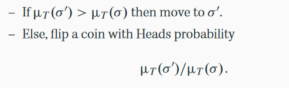
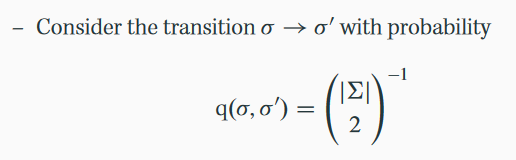

Quick Test
==========

To test running

`python run_deciphering.py -i data/warpeace_input.txt -d data/shakespeare_scrambled.txt` 

To scramble a custom text

`python scramble_text.py -i filename > output`

How to run the code
===================

Well, if you already happen to have an encoded text and wish to decode it, all you need to be concerned with `run_deciphering.py`.
Typing `python run_deciphering.py -h` would show

Usage: run_deciphering.py [options]

Options:

  -h, --help ........... show this help message and exit

  -i INPUTFILE, --input=INPUTFILE .......... input file to train the code on

  -d DECODE, --decode=DECODE .......... file that needs to be decoded

  -e ITERATIONS, --iters=ITERATIONS ........... number of iterations to run the algorithm for

  -t TOLERANCE, --tolerance=TOLERANCE .......... percentate acceptance tolerance, before we should stop

  -p PRINT_EVERY, --print_every=PRINT_EVERY ...........number of steps after which diagnostics should be printed

If you don't have an inputfile or a file to be decoded, and just want to play around, you can use default files provided in data folder. For example `python run_deciphering.py -i data/warpeace_input.txt -d data/shakespeare_scrambled.txt` would use `warpeace_input.txt` as input (courtesy Andrej Karphaty, @karpathy), and `shakespeare_scrambled.txt` a scrambled version of partial shakespeare book as a file to decode.

You have your own training data and you'd like that as a basis, you're recommended to use a scrambled version of a data of similar model as a file to decode, so that language model does not appear too foreign. Right now it works only on english, however you can modify the function the alphabets in `az_list.py` in `util.py`, to use your own model in a foreign language. 

If you wish to scramble a piece of text, use `python scramble_text.py -i filename > output`. It'd lessen your loads by tons! 

Also, you are welcome!

For PSTAT 160B, Winter 2023:
============================
You should pick your focus for the project.
A. coding/algorithms or,
B. theory/application.

You should submit a report with the following structure.

Section 1 (Introduction)

* Describe the contents of Lecture 8.
* Descibe what you do in this project.

Section 2 (MCMC algorithms). 
* Technical summary of Lecture 8 which converts the slides 
into a textbook style presentation of the subject.

Section 3 (Your contibution). 

* (Option A) Provide your changes to the Python code of code provided 
in class. Describe what improvements you have made to the code which 
could include aspects such as faster run time, documentation/comments, 
more modular/flexibile implementation that allows for new features.
Explain how your rewrite of the code corresponds to the Lecture 8 slides.

* (Option B) Propose a modification to the algorithm in Lecture 8.
For example, a different probability q for the proposal step on slide 15
(but many other options are possible -- see the Connor 2003 paper).
Explain why this proposal is interesting or possibly more effective than
what is in the current version of the code / Lecture 8 slides.
Document your modification and the experiments (encrypting/decrypting 
various text) to discuss what differences you observe in your version
versus the code version provided to you.

Section 4. (Summary)

* Summarize the most important ideas that you learned while doing
this project.

To Get the Code
=================
In order to get the code, open the repository, linked [here](https://github.com/alexbstl/MCMC-Deciphering/tree/python3). You can either clone this repository via Git, or Go to Code > Download Zip.  The repository can also be found at https://github.com/alexbstl/MCMC-Deciphering/tree/python3.  Make Sure the branch is `python3`! (The link should go there by default).

Code Walkthrough
============================
The code given does correspond to our algorithm, even though the similarities may not be directly obvious.  The following correspondences might be helpful.

* The entire decision on state updating given by  
  
is handled by the line: `if p2-p1 > np.log(u)` in the `metropolis_hastings.py` file.  Note that $u$ is a random variable sampled uniformly from $(0,1)$.

* This code was written by what seems to be a software engineer.  As such, many of the operations are extracted to their own methods to be as generic as possible.  It is, for instance, possible to pass in a different way to create permutations.  First, lets understand how `metropolis_hastings` knows what it needs to do this.  `metropolis_hastings` is called in the `run_deciphering.py` file (the one you actually run in python).  In it, you see: 

`metropolis_hastings(initial_state, proposal_function=propose_a_move, log_density=compute_probability_of_state,iters=iters, print_every=print_every, tolerance=tolerance, pretty_state=pretty_state)`

  In this block, what we care about are `proposal_function` and and `log_density`.  `proposal_function` constructs the permutations, whereas `log_density` assigns a probability to those permutations.  We will cover `log_density` later, because it uses some slight modifications that make it better for the computer. This code roughly corresponds to our definition of $q(\sigma,\sigma')$:
  

* The provided `proposal_function` for the code is given by the method `propose_a_move`, which can be found near the bottom of the `deciphering_utils.py` file.  This example is a simple transposition of two characters from the 56 possible (this code considers all lower and uppercase characters separately).

* The `log_density` method gives what is essentially the log-likelihood of a given state.  It does this via a call to `compute_probability_of_state`, which in turn calls `compute_log_probability_by_counts`, both of which are in the `deciphering_utils.py` file.  `compute_probability_of_state` doesn't do much, so we will examine `compute_log_probability_by_counts`.  In order to understand this, we also need to know how the text is processed.  Currently, whenever you see the variable `transition_matrix` or `transition_probabilities`, that corresponds to a matrix such that the element `transition_matrix[i,j]` is the probabilitiy of character `i` following character `j`.  To know what character corresponds to what index, the author has created the method `char_to_ix`. e.g. suppose we want to know the probability that $a$ followed $b$.  We would simply use `transition_matrix[char_to_ix(a)][char_to_ix(b)]`.  `transition_counts` is similar, but collects the un-normalized counts.  

MCMC Deciphering
================

Okay, so this deciphering looks fancy, right? Well actually in California Prison, prisoners were trying to transfer messages in an encoded format. Using a substituition cipher. And a Stanford Statistics professor thought of solving the code. How you wonder? Well, of course by using 'Markov Chain Monte Carlo'! Cool ri... "Uh what? Isn't MCMC a sampling method?"

Yep it is. And that is precisely what helped him solving the code. He actually used MCMC to sampling from a valid english language model by substituting different ciphers. A valid english language sample, because having a large probability of would have a higher probability of being sampled, and thus would be sampled more times than an invalid one... There by breaking the code!

Okay. Well if you'd like to know more, I'd highly recommend you to read [this paper](http://www-users.york.ac.uk/~sbc502/decode.pdf)

<!-- TODO
====

I have a few ideas to test by modifying and trying different language probability models, as basis. Also since right now it works only on codes based on substituition ciphers I'd like to see if I can figure out a way to use the same model for  -->
